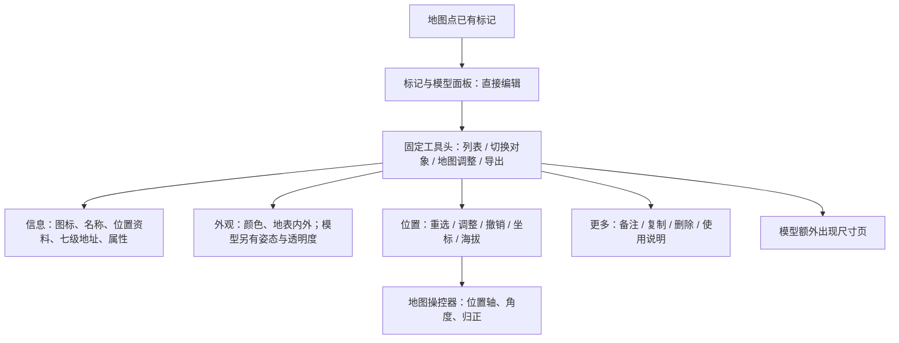
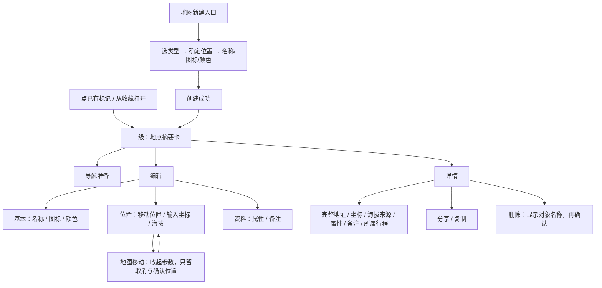

# 地点标记层级与操作顺序讨论稿（2026-09-09）

状态：**只做现状核对与方案讨论。用户已确认一级摘要卡，并要求一级不需要滚动；其余层级待讨论，没有实施 UI 改动。**

用户要求右侧持续保持手机比例，并按昨天的方式先核对标记层级、顺序和逻辑。当前应用在本机 `http://127.0.0.1:9174/`，视口已设置并核对为 390×844；原浏览器数据保留。本次讨论以普通地点标记为主，模型差异仅结合源码补充。

## 当次观察

| 步骤 | 页面或动作 | 当前状态与主要问题 |
| --- | --- | --- |
| 1 | 点已有地点标记，打开信息页 | 可用；直接进入可编辑表单。通用标题、列表/切换/调整/导出、页签连续占用顶部空间，名称下面的位置信息已需滚动。 |
| 2 | 向下滚动信息页 | 可用；七级地址与属性表处于同一滚动区，空属性行仍占空间。完整信息较难扫读。 |
| 3 | 外观页 | 可用；只有颜色和地表内/外等少量内容，而图标在信息页。普通地点也暴露模型相关放置概念。 |
| 4 | 位置页 | 可用；页内“地图调整”与顶部入口重复；“地图重选位置”“调整坐标”的关系不够清楚。 |
| 5 | 更多页 | 可用；备注、复制、删除、说明混在一层，内容与操作的归属不一致。未执行删除或修改。 |
| 6 | 地图调整状态 | 当前页面实际出现地点标记 X/Y 操控轴和角度输入。普通地点与三维模型使用同类工具；未拖动或修改参数。 |

当次记录：
- [01 信息首屏](../artifacts/screenshots/marker-audit-01-info-390-20260909.png)
- [02 信息底部属性](../artifacts/screenshots/marker-audit-02-address-390-20260909.png)
- [03 外观](../artifacts/screenshots/marker-audit-03-style-390-20260909.png)
- [04 位置](../artifacts/screenshots/marker-audit-04-position-390-20260909.png)
- [05 更多](../artifacts/screenshots/marker-audit-05-more-390-20260909.png)
- [06 地图调整](../artifacts/screenshots/marker-audit-06-map-adjust-390-20260909.png)

截图仅保存在本机忽略目录，主证据01/04/06已重新打开核对。第02张实际为滚动到属性底部，文件名中的address不表示地址首屏。第06张只用于说明操控工具，底图清晰度不作为本次审查结论。用户同期也在操作页面，不把选择器超时或视角变化直接归为应用Bug。

## 当前层级

## 需要先对齐的交互问题

1. **查看和编辑分开。** 当前没有独立的只读地点卡。一般只是看看位置，也先遇到图标和名称输入框。
2. **三类编辑行为分开。** 改名字/颜色、填坐标/海拔、在地图上移动，应是有名字的子步骤；不能都叫“调整”。
3. **保存语义明确。** `AnnotationIdentity` 的名称/属性以及备注/颜色目前直接调用 update，数值输入在失焦后提交；`useAnnotations.update` 随即持久化。因此关闭面板不等于撤销。建议保存/放弃是新方案，不能把它说成已经存在。
4. **关闭不应顺带进入操作态。** 首页在 `panel === null` 且保留选中对象时显示 ObjectGizmo；关闭一般标记面板可能转入地图操控器。建议“返回上一级”和“关闭本对象”分别定义。
5. **普通地点与模型共享资料基础，但不共享所有参数。** 地点保留坐标、海拔与简单移动；尺寸、朝向、旋转、剖切、离地/埋深归模型专用。
6. **分享的返回路径应清楚。** 当前单对象“导出”转到收藏输出界面；如果保留此复用，仍应能返回原对象详情。
7. **新建与查看已有对象不同。** 新建先确定位置并填写少量必要项；不能把所有参数页签和管理列表一起展开。

相关源码：[AnnotationPanel](../modules/annotations/AnnotationPanel.tsx)、[AnnotationIdentity](../modules/annotations/AnnotationIdentity.tsx)、[AnnotationLocation](../modules/annotations/AnnotationLocation.tsx)、[useAnnotations](../modules/annotations/useAnnotations.ts)、[首页入口与ObjectGizmo](../app/page.tsx)。以上是源码核对，未通过修改真实数据实验验证保存/删除。

## 建议层级：一级已确认，其余待讨论

用户已确认一级摘要卡：图标＋名称、简短位置、海拔；下方导航、编辑、详情。**一级不滚动，三个主要操作始终可见。** 名称和地址过长时截断，在详情查看完整内容；完整坐标、七级地址、属性和备注进入详情。一级不放对象下拉框、属性编辑表、旋转参数、批量导出或删除。后续实现需要以390×844和360×780检查首层内容完整可见，而不是用缩小触控目标换空间。

### 建议的返回与保存规则

- 摘要卡的关闭：回地图并退出本对象操作，不自动进入三维操控器。
- 导航准备/编辑/详情的返回：回同一个地点摘要卡，保留对象和地图位置。
- 编辑的基本/位置/资料为同一草稿；保存成功才提交，失败留页；有修改时返回可以保存、放弃或继续编辑。
- 地图移动的确认：仅确定本次草稿位置，回位置编辑；取消移动恢复进入移动前的草稿位置，避免“确认位置”被误解为保存全部。
- 详情默认只读。完整字段与空值按需展开；分享、复制和删除归于详情下的对象操作。
- 删除应明确删除对象名称及关联影响；返回、取消都不执行删除。
- 新建取消不留下空对象；创建后回摘要卡。沿线新建保留原路线关联。
- 旧标记格式、手工资料、来源标签、集合归类与导出兼容性，在未来实施时需要保留。
- 标记导航入口属于待设计/接线项，不能从现有路线导航能力直接推断现有标记卡已经具备此按钮。
- 普通地点本轮优先；模型专用页及操控流程另行细化，避免无关参数污染地点操作。

## 验证边界与下一步

已完成当前视口、可见字段、页签和地图操作态的截图/DOM观察；390×844无文档横向溢出。尚未做360×780、键盘弹起、读屏、焦点顺序、保存失败或真机触控测试。本轮不实施功能、不生成新APK。

**一级摘要卡及不滚动要求已确认。** 下一步逐层讨论编辑、位置移动和详情。讨论清楚后才绘制界面方案并实施，不把其余建议当作已经批准。
