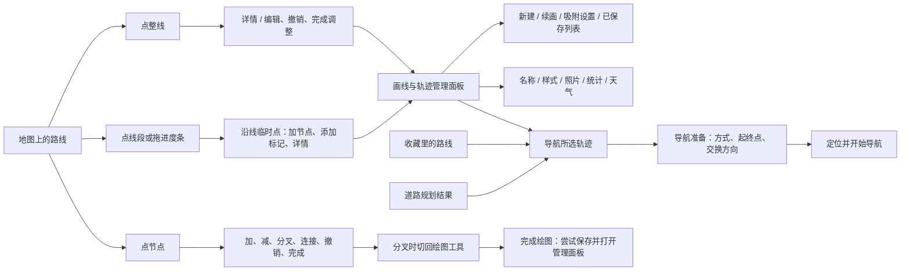
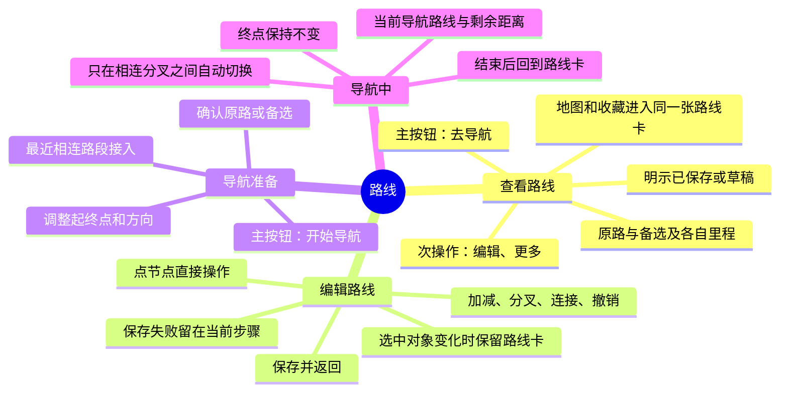

# 路线 UI 层级、脑图与历史问题清单

审查对象：0.2.13 源码及本机 9191 当前页面。2026-09-08。本轮只梳理，不实施 UI 改版；建议均未交付。未启动 GPS 导航，未修改用户路线、清理数据或刷新预览。

## 结论

目前把“我选中了什么”“我正在做什么”“数据是否保存”“能否导航”混在一起。选择整线、线段、节点分别出现不同操作栏；路线详情又复用了包含新建、绘图设置、列表、统计的管理面板。导航入口虽已存在，却不在用户正在操作的位置。

应先统一路线状态与返回规则，再精简布局。继续逐个缩小弹窗，无法消除流程混乱。

## 现状脑图

“路线”底部入口偏道路规划，“画线”入口同时管理手绘与保存轨迹，“收藏”也能打开和导航。共享导入线路还有独立详情视图。用户眼中的同一种对象，因来源和点中位置不同走进了不同流程。

## 建议脑图：一个路线对象，四种明确状态

补充规则：

- 查看时，点线段、点节点都是改变同一张卡的当前选择，不应丢失路线名称、状态和导航入口。节点工具保持直接可达，不额外套一层“详情/编辑”。
- “去导航”仅进入准备页；“开始导航”才请求定位并开始会话。草稿显示“保存并去导航”；失败明确指出孤立点、断开段、距离不足或存储错误，并留在原地。
- 编辑保存成功回到同一条路线的查看卡。取消选择、返回、保存、结束导航分别命名；禁止一个“完成”承担四种含义。
- 建议将当前选中的原路/备选带入导航准备，并显示所替换区间与预计里程。默认原路。最近接入仍遵循原授权，实际走入相连分叉后自动切换并提示新里程，终点不变；不跳到无关收藏线。
- 左侧条在查看时叫“路线浏览”，在导航时叫“导航进度”。浏览绿点不是 GPS 位置。颜色同时配合“原路/备选”标签，不只靠颜色区分。
- 照片、统计、天气、样式、导出放入路线卡的“更多”；新建与收藏列表留在对象选择入口，不与当前节点操作混排。

## 当前究竟什么时候能导航

| 当前状态 | 当前实现 | 应给用户的明确提示 |
|---|---|---|
| 已保存手绘路线 | 详情/画线列表/收藏有导航入口；地图整线、线段、节点工具没有统一入口 | 已保存 · 去导航 |
| 草稿或续画尚未保存 | `navigateTrack` 只查询 saved；需先成功保存 | 草稿 · 保存并去导航 |
| 单独孤立点、坐标无效、网络不相连 | 转换或网络校验拒绝导航 | 指出问题点/断开位置，提供继续编辑 |
| 已连接的分叉或闭环 | 可通过网络路径导航；不要求所有几何段合成一根无分叉线 | 已连接 · 可导航；不要说“尚未连成一条” |
| 路径不足 20 米，或起终点选不到有效路径 | 报错；准备页的选择错误禁用开始 | 具体说明距离/端点问题 |
| 道路规划已有结果 | 可进入准备；交换方向或出行方式可能重新请求规划 | 路线准备好 / 正在重新规划 |
| 准备页点“定位并开始导航” | 创建会话并请求定位；仍可能等待权限、有效 GPS、接入路线 | 分开显示等待定位、正在接入、导航中 |

以上由 `app/page.tsx` 的 `navigateTrack/beginFavorite/activateGuidance`，`modules/guidance/savedRoute.ts`、`network.ts`、`direction.ts` 和 `NavigationStart.tsx` 核查。能打开准备页不等于已经得到可靠定位或完成真机导航验收。

## 本轮实际观察到的步骤

截图保留在本机 `artifacts/screenshots/`，不上传用户路线图片。浏览器截图将内容缩放在画面左上，接受其作为状态记录，文字以同步 DOM/可访问树核对；不用于像素级尺寸、对比度或真机触控结论。

| 步骤 | 截图 | 健康情况与发现 |
|---|---|---|
| 1 线段选点 | audit-route-01-linepoint.png | 有临时选点说明；主按钮是添加标记，没有导航。左侧备选选择容易被理解为导航选择。 |
| 2 点击“详情” | audit-route-02-details.png | 能找到导航；但打开整套“画线与轨迹”管理面板，混入新建、吸附和其他路线。此时可访问树里同一路线含“导航所选轨迹”和列表导航两处入口。 |
| 3 点击“导航所选轨迹” | audit-route-03-navigation.png | 起终点和方式可见，存在明确启动按钮；里程从备选浏览约 1642.6 km、详情总长约 1963.9 km 变为导航约 917.9 km，没有解释为何改变。未点击启动定位。 |
| 4 退出准备后查看地图 | audit-route-04-selection.png | 又出现整线“详情 / 编辑、撤销、完成调整”；本机页面 DOM 查到四个重叠的轨迹进度组件，需在干净生产构建复现。当前页面可能同时被用户操作，不将返回目标变化直接判为稳定复现的返回 bug。 |

当前节点与草稿流程补充依据：用户本轮明确提供的历史截图，以及当前 `TrackNodeTools.tsx`、`useManualTracks.ts` 和 app 条件分支。没有在本轮重新创建草稿、移动节点或启动实走，避免修改用户数据。

## 待处理问题，按顺序

| ID / 优先级 | 问题 | 证据与状态 | 建议验收 |
|---|---|---|---|
| UI-01 / 高 | 整线、线段、节点各一套菜单，导航入口不固定 | 步骤 1–4；app 三个条件分支已确认 | 从地图/收藏进入，路线卡身份和去导航入口一致 |
| UI-02 / 高 | 选择备选没有传入导航准备；导航可能取更短网络路径 | 步骤 1/3；`activeAlternative` 只传图层/进度组件，`navigateTrack` 未接收它；`orientTrack` 重算 networkPath | 原路/备选选择、准备预览、启动路线一致；最近接入与相连分叉自动切换仍有效 |
| UI-03 / 高 | 详情把相连分叉写成“尚未连成一条” | 步骤 2；JourneyPanel 按 joinSegments 的链数判断，导航按图连通判断 | 区分连续单线、已连通分叉、真正断开；采用同一连通结论 |
| UI-04 / 高 | 绘图“完成”在保存失败后仍退出编辑 | 代码确认：useManualTracks.complete 忽略 saveDraft 的 false，随后关闭 drawing/editing；app 打开管理面板。本轮未制造写入失败 | 孤立点/存储失败时留在编辑、草稿可见、下一步明确；成功才退出 |
| UI-05 / 中 | “完成”含义不一致 | 草稿节点完成保存；已存节点完成取消选择；整线完成调整仅取消选择；绘图完成保存并打开列表 | 按实际行为命名，固定返回目标 |
| UI-06 / 高 | 浏览、详情、导航显示不同里程却都叫线路距离 | 步骤 1–3；进度按方案，详情按所有段总和，导航按所选网络路径 | 主里程统一为当前方案；网络总长度只放详情并明确标签 |
| UI-07 / 中 | 详情里包含新建、续画、吸附、其他路线和统计 | 步骤 2；TrackPanel | 当前路线操作与管理列表分开，主按钮固定可达 |
| UI-08 / 中 | 临时进度点和真正导航进度难区分 | 步骤 1；绿点可拖、名称强调进度 | 明示浏览/导航；GPS 标记与临时点区分 |
| UI-09 / 待复现 | 当前预览有 4 个重叠进度组件 | 步骤 4 DOM 数量确认；源码仅一个 TrackJourneyRail 位置。可能与开发热更新/状态残留有关，根因未确认 | 在隔离生产页面复现进入/退出详情和导航，不刷新用户草稿；任何状态最多一个轨迹进度组件 |
| UI-10 / 待验证 | 导航弹窗焦点仍在背景“导航所选轨迹”按钮 | 步骤 3 可访问树；NavigationStart 未显式管理焦点 | 打开后焦点进入弹窗、Tab 不进入背景、关闭返回触发按钮；需键盘与读屏验证 |

这些是流程/实现问题，不应继续以“把按钮排紧一点”替代修复。UI-04 本轮仅代码审查，不声称新故障已在真机复现；UI-09 不直接归因到已发布 APK。

## 之前的 bug 与需求归档

历史完成状态来自本仓库版本说明与 CURRENT_STATE，不表示本轮重新验证全部功能。此前 315 项逻辑通过不能证明整套 UI 流程清晰。

| 历史反馈 | 归档状态 | 本轮结论 |
|---|---|---|
| 分叉时旧线中间节点消失，不能接回闭环 | 0.2.13 已修复；节点显示及草稿吸附候选补齐 | 保留回归，真机拖动体验待验 |
| 节点要直接加减、分叉、连接 | 0.2.13 已实现紧凑直接工具条 | 单点操作修了，整线/线段/节点的统一层级仍未完成 |
| 删除中间点后前后连接，允许加入中间点 | 0.2.12/13 已实现 | 保留孤立点、两点段限制和撤销测试 |
| 新绕路颜色不同，切换后跳过原区间 | 0.2.13 浏览方案已实现 | 导航联动未完成，见 UI-02；不能笼统称全部完成 |
| 左侧并列进度条太宽 | 0.2.13 已收紧为共享 44px 触控区、10px 视觉轨道 | 尺寸有回归记录；本轮另见重叠实例待复现 |
| 优先最近接入，实走其他分叉自动切换 | 0.2.12 已有网络逻辑和模拟验证 | 只在相连路线内、固定终点；真机实走待验 |
| 导航前调整起终点方向 | 0.2.12 已实现 | 本轮准备页再次看见端点和交换按钮；入口仍需统一 |
| 收藏文件夹分类丢失、关不了、颜色难辨 | 0.2.12 已恢复分类首页/关闭入口/彩色底 | 本轮未复测收藏流程，保留版本回归状态 |
| 默认打开卫星图 | 0.2.12 已实现 | 不属于本轮流程改版 |
| 手机地图闪烁 | 部分重复刷新已处理 | 尚未完成真机复现和确认，不标彻底解决 |
| APK 每轮更新 | 0.2.13 已公开发行 | 本轮仅审查文档，不改 APK 内业务源码，不生成空改版包 |
| HarmonyOS 6.1 原生安装 | 未交付 | 缺工程适配、工具链/签名和安装验证 |
| 谷歌地图能否加入、是否开源 | 之前仅研究说明 | 未接入；不能记为图源已交付 |

## 建议实施顺序与验收场景

1. 先处理 UI-02/03/04/06：统一当前路线方案、连通性、里程与保存结果，避免界面承诺和实际行为不同。
2. 将 UI-01/05/07 合并为一次流程整理：单一路线卡，显式四状态，节点工具内嵌，返回有唯一含义。
3. 处理 UI-08/09/10，再检查 390×844、360×780 的布局、焦点、手势冲突和遮挡；发布新 APK 后安排真机走分叉验收。

验收至少覆盖：收藏进入与地图进入同线；草稿成功/失败保存；选节点后分叉接回；原路与绕路的全程距离和跳过区间；方向交换；最近接入；走入相连备选后切换；无关收藏不吸附；导航退出回原路线；展开收起后进度组件不重复。保存失败、切换路线和退出页面均不能丢数据。

本轮结果：梳理与证据记录 PASS；UI 改版未实施；APK 维持 0.2.13；实走、真机触控与完整无障碍验收未执行。
